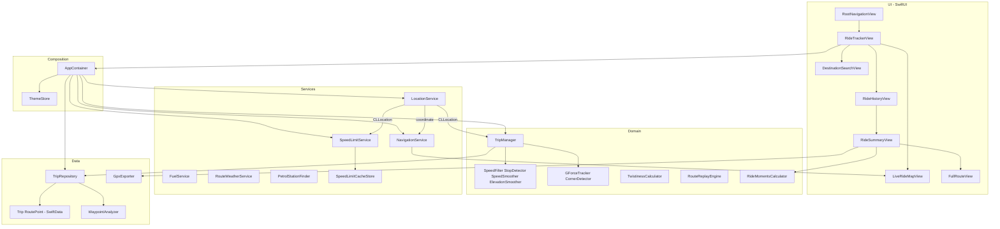

# MotoTripTracker (iOS)

A SwiftUI motorcycle ride tracker for iPhone. Record GPS rides in the background, see live speed and road speed limits, review history with physics insights (G-force, corners), and share or export routes.

The app is the iOS counterpart of the Android **MotoTripTracker** project, with feature parity for tracking, Overpass speed limits, ride moments, favorites, and GPX/share.

---

## Features

### Live ride tracking
- **Split dashboard**: live MapKit map on top (~46%), speedometer + stats below
- **Live map** with follow-camera and 3D pitch while riding; gentle top-down view when idle
- **Traveled trail** drawn on the map as a mint polyline during the session
- **Start / pause / resume / stop** with keep-screen-on while riding
- **Background location** (Always authorization) so recording continues with the screen locked. **When In Use only is not enough** — without Always, GPS stops on lock and the ride clock freezes (Live Activity can still appear with stale stats). The dashboard warns and links to Settings if Always is missing.
- **Neon glow speedometer** (270° ring with blurred underlay) and centered European-style speed-limit badge
- **Dashboard metrics**: distance, moving/stopped time, avg/max speed (max from raw GPS, avg capped by peak and based on speed-consistent distance), elevation gain, longitudinal G, lateral G, **twistiness score** (0–100 from corner density + lateral G)
- **GPS quality** and **battery** as floating chips on the map; **Options** menu (History, Leaderboard, theme) hidden while riding so it does not overlap the map compass
- Short rides under **50 m** are discarded automatically

### Live Activities & Home Screen widgets
- **Live Activity** on Lock Screen and Dynamic Island while a ride is active: speed, limit, distance, moving time, over-limit tint, optional nav ETA summary
- Starts / pauses / ends with the ride lifecycle; updates throttled to ~1 Hz
- **Last Ride** and **This Week** Home Screen widgets (small + medium), fed via App Group snapshot when trips are saved
- Requires Live Activities enabled in Settings; widgets appear after a long-press on the Home Screen → Widgets → MotoTripTracker

### Navigation (destination & route)
- **Set destination** via search sheet (`MKLocalSearchCompleter` autocomplete)
- **Driving route** computed with `MKDirections` and drawn on the map in blue
- **Compact turn HUD**: next-maneuver card at the **top** of the map (distance + one-line instruction); thin bottom chip for ETA / remaining, weather, voice mute, Apple Maps, and clear — so the map stays visible while navigating
- **Spoken turns** (`AVSpeechSynthesizer`): announces approach (~250 m) and on step advance; mute from the bottom chip; prefers a Greek voice when available. Light haptic still fires on advance
- **Off-route recalculation** when you stray ~80 m from the planned polyline (cooldown to avoid spam)
- **Distance remaining** and **ETA** update as you move
- **Nearest petrol** opens a **recommendation list** ranked by saved brand order (e.g. Shell → BP), preferred octane (98 / 100), open status, then distance. Search radius **adapts to context** — tighter in cities (2–10 km), wider in towns/rural (20–50 km), and **highway-biased** when riding fast on motorways. Each card shows **Open now / Closed now / Hours unknown** (from OSM when tagged), short hours when available, **preference-match stars** (brand + octane fit — Apple Maps ratings are not readable by apps), Preferred / Highway / octane chips, and address when MapKit provides one. **Details** opens Apple’s place card; compact **Go** starts in-app navigation. Stations marked closed in OSM are filtered out.
- **Route weather** (Open-Meteo): when a route is computed, forecasts are sampled along the plan at estimated arrival times. Tap the weather glyph on the bottom chip for the full timeline
- **Open in Apple Maps** for handoff; clear route from the bottom chip

### Fuel & range
- Tank capacity, remaining liters, and L/100 km consumption (persisted)
- **Estimated range** chip on the map; burns fuel from trip distance while riding
- **Fill up** and low-fuel warning (under 20% or under ~40 km range)
- Live Activity can surface low-fuel / next-maneuver text while riding

### Speed limits (OpenStreetMap / Overpass)
- Automatic `maxspeed` lookup near your position
- **Bundled Greater Athens pack** (~4k grid cells) for offline limits inside the metro area
- **Overpass fallback** outside that pack, when a grid cell is empty, or when GPS speed is clearly above the packed limit (wrong nearby street)
- **Over-limit warning**: sign flashes and a translucent full-screen flash overlays the dashboard
- Resilient lookup: multiple Overpass mirrors, expanding radii, highway priority, implied GR defaults when OSM has no `maxspeed` tag, disk grid cache with neighbor fallback
- Rebuild Athens pack: `python3 Scripts/build_athens_speed_limit_pack.py`

### Physics & ride quality
- **Longitudinal G** from GPS speed deltas (clamped), resistant to handlebar vibration
- **Corners** detected from bearing changes while moving
- **Lateral G** estimated from turn radius (`v² / r`)
- **Twistiness score** (0–100): combines corners-per-10 km with peak lateral G; ratings from *Straight* → *Flowing* → *Twisty* → *Epic twisties*. Persisted on each trip and shown live on the dashboard.
- Speed smoothing, teleport rejection (>80 m jumps), elevation noise filtering, stop-time from near-zero speed

### History & trip meta
- Chronological ride list with **All / Favorites** tabs
- Native **search** and date filters (today, yesterday, week, month, **custom range**)
- Rename rides and mark favorites (including swipe actions)
- Empty states via `ContentUnavailableView`

### Personal leaderboard
- Rank your own rides by **Speed** (max km/h), **Distance** (km), **Turns** (corner count), or **Twistiness** (composite score)
- Segmented categories; tap a row to open the same ride **summary** as History
- Gold / silver / bronze badges for the top three ranks

### Summary & sharing
- Stats overview (including **twistiness** rating) and **Ride Moments** (timed highlights: peak rush, climbs, pauses, cruise windows, twistiness — distinct from Stats)
- Map preview with encoded polyline
- **Share card** image: route map, stats strip (max speed, twistiness, corners, moving time), and top moments; plus **GPX** export
- **Replay route** from summary menu — opens the full route view with playback controls

### Full route map & replay
- MapKit route polyline colored by speed or elevation
- Segmented Speed / Elevation layers
- Elevation or speed profile chart
- Waypoints (start/end, top speed, summit, stops, etc.) with reverse-geocoded labels where available
- **Route replay**: play / pause / scrub timeline at 1×–4× speed; map follows the rider with traveled vs remaining route highlighted; live speed readout during playback

### UI & theming
- Ride dashboard uses a **HUD-style** layout (hidden nav bar, map overlays) rather than a classic toolbar screen
- Native iOS navigation elsewhere (toolbars, large titles, inset grouped lists, searchable)
- Dark / light themes with brand mint/green/blue accents; theme toggle in the dashboard Options menu
- Over-limit flash keeps the dashboard readable under translucent color

---

## Architecture

The app uses a layered structure with a single composition root (`AppContainer`) that wires SwiftData, domain logic, and platform services.



### Layer responsibilities

| Layer | Role | Key types |
| --- | --- | --- |
| **UI** | Screens, navigation, theme | `RootNavigationView`, tracker / live map / destination search / history / summary / route views, `ThemeStore` |
| **App** | DI / composition root | `AppContainer`, `MotoTripTrackerApp` |
| **Domain** | Ride loop, filtering, physics, moments | `TripManager`, `TripStats`, detectors / smoothers, `TwistinessCalculator`, `RouteReplayEngine`, `RideMomentsCalculator` |
| **Services** | Platform & network | `LocationService`, `SpeedLimitService`, `NavigationService`, `FuelService`, `RouteWeatherService`, `PetrolStationFinder`, `OSMMaxSpeedParser` |
| **Data** | Persistence & export | `TripRepository`, SwiftData models, `WaypointAnalyzer`, `GpxExporter`, `PolylineEncoder` |
| **Utilities** | Cross-cutting helpers | `AppLogger`, `RideFormatters`, `RideShareHelper` |

### Ride session flow

1. User taps **Start Ride** → `AppContainer.startRide()`
2. `LocationService` begins GPS updates (background allowed when Always is granted)
3. Each fix is validated (`SpeedFilter`), then fed to `TripManager`, `SpeedLimitService`, and `NavigationService` (route ETA + weather-ahead refresh when a destination is set)
4. `TripManager` updates `TripStats`, persists route points via `TripRepository`, and runs corner / G / elevation / stop logic
5. **Stop** finalizes the trip (or deletes it if under 50 m), encodes a polyline, and runs waypoint analysis asynchronously

### Persistence (SwiftData)

- **`Trip`**: aggregate stats, title, favorite, polyline, lateral G, corner count, twistiness score
- **`RoutePoint`**: lat/lon/altitude/speed/timestamp + optional waypoint metadata  
  Cascade-deleted with the parent trip

### Speed limit pipeline

1. Prefer **bundled region pack** (Greater Athens) when inside its bbox
2. Fall through to Overpass on empty cells, outside the pack, or when GPS speed is clearly above the packed limit
3. Throttle network by distance (~25 m) and time (~8 s)
4. Check **grid cache** (and neighboring cells offline)
5. Query Overpass mirrors with expanding radius
6. Parse OSM tags (`OSMMaxSpeedParser`); if no `maxspeed`, use implied GR highway defaults
7. Prefer higher-priority highway types when multiple ways match

### Logging

Structured `os.Logger` categories (`App`, `Location`, `Trip`, `Persistence`, `SpeedLimit`, `Navigation`, `Waypoint`, `Sensors`) with `LogThrottle` to avoid flooding from 1 Hz GPS.

---

## Project layout

```
MotoTripTracker/
├── MotoTripTrackerApp.swift      # @main entry
├── AppContainer.swift            # Composition / DI
├── Domain/                       # Trip loop & algorithms
├── Data/                         # SwiftData models, repository, waypoints
├── Services/                     # Location, Overpass speed limits, navigation, Live Activity / widget publishers
├── UI/
│   ├── Navigation/
│   ├── Tracker/                  # RideTrackerView, LiveRideMapView, DestinationSearchView, PetrolStationsView, RouteWeatherView, FuelSettingsView
│   ├── History/
│   ├── Leaderboard/
│   ├── Summary/
│   ├── Route/
│   ├── Splash/
│   └── Theme/
└── Utilities/                    # Logging, GPX, share, formatters, polyline
MotoTripTrackerShared/            # App Group models shared with the widget (ActivityAttributes, snapshot)
MotoTripTrackerWidgets/           # WidgetKit extension (Live Activity UI + Home Screen widgets)
MotoTripTrackerTests/             # Unit tests (filters, detectors, parsers, …)
MotoTripTrackerUITests/           # UI test targets
```

---

## Tech stack

| Area | Choice |
| --- | --- |
| UI | SwiftUI, NavigationStack, MapKit |
| Persistence | SwiftData |
| Location | Core Location (background mode: `location`) |
| Speed limits | Overpass API (OpenStreetMap) — no Google Maps API key |
| Petrol stations | Overpass (fuel + opening hours) + MapKit enrichment |
| Route weather | Open-Meteo forecast API (no API key) |
| Maps | Apple MapKit (system; no Maps API key required for native display) |
| Widgets / Live Activities | WidgetKit + ActivityKit (App Group `group.com.odys.MotoTripTracker`) |
| Concurrency | `@MainActor`, `Task` / `async` for network & waypoint work |
| Observation | `@Observable` for session, theme, speed-limit state |

**Bundle ID:** `com.odys.MotoTripTracker`  
**Deployment:** iOS (see Xcode project for current deployment target)

---

## Permissions

- **When In Use** location — record rides and show live speed
- **Always** location — continue recording in background / screen locked  
  Usage strings are set via `INFOPLIST_KEY_NSLocation*` in the Xcode project.

---

## Building & testing

1. Open `MotoTripTracker.xcodeproj` in Xcode
2. Select an iPhone simulator or device
3. Build & run (`⌘R`)
4. Unit tests: Product → Test, or:

```bash
xcodebuild -scheme MotoTripTracker \
  -destination 'platform=iOS Simulator,name=iPhone 17' \
  -only-testing:MotoTripTrackerTests test
```

On a real device, grant **Always** location for background tracking, and ride outdoors for meaningful GPS / Overpass results.

---

## Related project

Feature design and domain behavior closely follow the Android **MotoTripTracker** app (Kotlin / Compose / ObjectBox). This iOS port uses SwiftUI, SwiftData, and MapKit instead of Compose, ObjectBox, and Google Maps.
