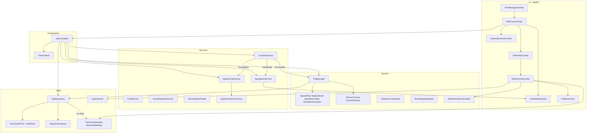

# MotoTripTracker (iOS)

A SwiftUI motorcycle ride tracker for iPhone. Record GPS rides in the background, navigate with turn-by-turn guidance, check road speed limits and fuel range, review history with physics insights (G-force, corners, twistiness), share or export routes, and optionally upload completed rides to your own backend.

The app is the iOS counterpart of the Android **MotoTripTracker** project, with strong parity for tracking, Overpass speed limits, ride moments, favorites, and GPX/share — plus iOS-native navigation, Live Activities, and widgets.

---

## Features

### Live ride tracking
- **Split dashboard**: live MapKit map on top (fills leftover space), original-size speedometer flush above Start / Pause, ride stats scroll below the dial like before
- **Live map** with follow-camera and 3D pitch while riding; gentle top-down view when idle
- **Traveled trail** drawn on the map as a mint polyline during the session
- **Start / pause / resume / stop** with **keep-screen-on while a ride is active** (including paused) so auto-lock does not dim the dashboard mid-ride
- **Location permissions — read this before riding**
  - **Always** — required for recording with the screen locked or the app in the background. Background GPS is enabled **only during an active ride** and only when Always is granted.
  - **While Using the App** — fine for testing with the app open on the dashboard; GPS stops when the screen locks.
  - **Allow Once** — **do not use for rides**. It is temporary, does not enable background recording, and can leave the app in a bad permission state if you tap through prompts while trying to fix settings.
  - The dashboard shows an **orange warning** during rides without Always; tap it to request Always or open Settings.
- **When In Use / Allow Once is not enough** for locked-screen rides — without Always, GPS pauses on lock and the ride clock freezes (Live Activity can still show stale stats).
- **Neon glow speedometer** (270° ring with blurred underlay) and centered European-style speed-limit badge (display-only; no manual override)
- **Dashboard metrics**: distance, moving/stopped time, avg/max speed (max from raw GPS, avg capped by peak and based on speed-consistent distance), elevation gain, longitudinal G, lateral G, **twistiness score** (0–100 from corner density + lateral G)
- **GPS quality** and **battery** as floating chips on the map; **Options** menu (History, Leaderboard, Fuel & Range, Cloud Sync, Nearest Petrol, theme) hidden while riding so it does not overlap the map compass
- Short rides under **50 m** are discarded automatically

### Launch & branding
- **Animated splash** (`SplashView`): logo scale-in, speedometer needle, GPS bars, and road motion over a dark launch background
- Real UI stays mounted under the splash (opacity visible after dismiss) so MapKit, SwiftData, and navigation warm up during the intro instead of on the first History / destination tap
- App icon and splash assets live in `Assets.xcassets` (`AppIcon`, `AppLogo`, `SplashBackground`)

### Live Activities & Home Screen widgets
- **Live Activity** on Lock Screen and Dynamic Island while a ride is active: speed, limit, distance, moving time, over-limit tint, optional nav ETA summary
- Starts / pauses / ends with the ride lifecycle; updates throttled to ~1 Hz
- **Last Ride** and **This Week** Home Screen widgets (small + medium), fed via App Group snapshot when trips are saved
- Requires Live Activities enabled in Settings; widgets appear after a long-press on the Home Screen → Widgets → MotoTripTracker

### Navigation (destination & route)
- **Set destination** via search sheet (`MKLocalSearchCompleter` autocomplete); **Recent** history for quick re-pick (**swipe to delete**)
- Destination pick shows **alternate routes** on the map; **Start** begins turn-by-turn; **Cancel** clears preview
- **Driving route** computed with `MKDirections` (automobile + **traffic-aware** `departureDate`) and drawn on the map in blue
- **Live traffic** shown on the dashboard MapKit map (`showsTraffic`)
- **Moto ETA** on preview and guidance: car traffic delays are only partly applied (bikes can filter); the factor **learns** from your completed navigations
- After a guided trip ends (you arrive, or clear the route), a short banner compares **actual time vs car traffic ETA**
- **Auto-arrives** within ~45 m of the destination (with a short dwell) and ends guidance, speaks “You have arrived”, then shows the timing banner
- **Compact turn HUD**: next-maneuver card at the **top** of the map (distance + one-line instruction); thin bottom chip for remaining distance / moto ETA, optional “Cars +N min” hint, weather, voice mute, Apple Maps, and clear — so the map stays visible while navigating
- **Spoken turns** (`AVSpeechSynthesizer`): announces approach (~250 m) and on step advance; mute from the bottom chip; uses an English voice (MapKit instructions are English). Light haptic still fires on advance
- **Off-route recalculation** when you stray ~80 m from the planned polyline (cooldown to avoid spam)
- **Distance remaining** and **ETA** update as you move
- **Traffic cameras** (speed + red-light): while recording a ride, nearby OSM cameras appear on the map; approaching one triggers voice + haptic + a short banner (warn distance scales with speed). Offline packs: nationwide `greece_traffic_cameras.json` (~400 speed cameras) plus Greater Athens fill-in; while riding, the app auto-downloads the country pack from [speedcams.world](https://speedcams.world/download) when needed and falls back to live Overpass (`highway`/`device`/`enforcement`/`camera:type`). Coverage follows OpenStreetMap — many real Greek cameras (especially red-light) are unmapped. Mute nav voice to silence camera prompts too.
- **Nearest petrol** opens a **recommendation list** ranked by saved brand order (e.g. Shell → BP), preferred octane (**95 / 98 / 100**), open status, then distance. Search radius **adapts to context** — tighter in cities (2–10 km), wider in towns/rural (20–50 km), and **highway-biased** when riding fast on motorways. Each card shows **Open now / Closed now / Hours unknown** (from OSM when tagged), short hours when available, **preference-match stars** (brand + octane fit — Apple Maps ratings are not readable by apps), Preferred / Highway / octane chips, and address when MapKit provides one. **Details** opens Apple’s place card; compact **Go** opens route preview, where **Start** begins turn-by-turn navigation. Stations marked closed in OSM are filtered out.
- **Route weather** (Open-Meteo): when a route is computed, forecasts are sampled along the plan at estimated arrival times. Tap the weather glyph on the bottom chip for the full timeline
- **Open in Apple Maps** for handoff; clear route from the bottom chip

### Fuel & range
- Tank capacity, remaining liters, and L/100 km consumption (persisted)
- **Estimated range** chip on the map; burns fuel from trip distance while riding
- **Fill up** and low-fuel warning (under 20% or under ~40 km range)
- Live Activity can surface low-fuel / next-maneuver text while riding

### Speed limits (OpenStreetMap / Overpass)
- Automatic `maxspeed` lookup near your position
- **Bundled Greater Athens pack** (~4.4k grid cells) for offline limits inside the metro area
- **Overpass fallback** outside that pack, when a grid cell is empty, or when GPS speed is clearly above the packed limit (wrong nearby street)
- **Over-limit warning**: speed-limit sign flashes as soon as you exceed the limit; translucent full-screen flash starts at **+10 km/h** over the limit
- Resilient lookup: multiple Overpass mirrors, expanding radii, highway priority, implied GR defaults when OSM has no `maxspeed` tag, disk grid cache with neighbor fallback
- Rebuild Athens packs: `python3 Scripts/build_athens_speed_limit_pack.py` and `python3 Scripts/build_athens_traffic_cameras_pack.py`

### Physics & ride quality
- **Longitudinal G** from GPS speed deltas (clamped), resistant to handlebar vibration
- **Corners** detected from bearing changes while moving
- **Lateral G** estimated from turn radius (`v² / r`)
- **Twistiness score** (0–100): combines corners-per-10 km with peak lateral G; ratings from *Straight* → *Flowing* → *Twisty* → *Epic twisties*. Persisted on each trip and shown live on the dashboard.
- Speed smoothing, teleport rejection (>80 m jumps), elevation noise filtering, stop-time from near-zero speed
- **Moving / stopped time** accumulated in milliseconds during the ride (avoids under-counting from sub-second GPS intervals); older trips are repaired on launch when timings look truncated

### Cloud sync (optional backend)
- **Cloud Sync** in the dashboard **Options** menu — set a backend base URL (e.g. `http://192.168.1.10:8080` on your LAN while testing a local Ktor server)
- Leave the URL **empty** to disable upload entirely
- After **Stop**, completed rides **auto-upload** in the background to `POST {baseURL}/v1/trips/upload` (trip stats, polyline, and route points as JSON)
- **Upload to server** on Ride Summary for a manual retry when auto-upload failed or you were offline
- A stable client **user ID** is generated once and sent with each payload; upload is best-effort and non-blocking
- This is **post-ride upload only** — not multi-device sync or live buddy share (see [`docs/RND-Backend.md`](docs/RND-Backend.md) for planned ideas)

### History & trip meta
- Chronological ride list grouped by day — **Today**, **Yesterday**, then **`dd/MM/yyyy`** — with time-only rows inside each section
- **All / Favorites** tabs
- Native **search** and date filters (today, yesterday, week, month, **custom range**)
- Rename rides and mark favorites (including swipe actions)
- Empty states via `ContentUnavailableView`

### Personal leaderboard
- Rank your own rides by **Speed** (max km/h), **Distance** (km), **Turns** (corner count), or **Twistiness** (composite score)
- Segmented categories; tap a row to open the same ride **summary** as History
- Gold / silver / bronze badges for the top three ranks

### Summary & sharing
- Stats overview (including **twistiness** rating) and **Ride Moments** (timed highlights: peak rush, climbs, pauses, cruise windows, twisties — distinct from Stats)
- Map preview with encoded polyline
- **Share card** image: MapKit route snapshot, compact stats strip (max speed, twistiness, corners, moving time), and top moments; plus **GPX** export
- **Upload to server** when Cloud Sync is configured (see above)
- **Replay route** from summary menu — opens the full route view with playback controls

### Full route map & replay
- MapKit route polyline with a **continuous speed gradient** (teal → blue → coral; slower → faster) or elevation coloring
- Segmented Speed / Elevation layers
- Elevation or speed profile chart
- Waypoints (start/end, top speed, summit, stops, etc.) with reverse-geocoded labels where available; Full Route **re-runs analysis** if markers were missing after a background finalize
- If stored route points fail to load, Full Route **falls back to the trip’s encoded polyline** so the map is not blank (replay detail may be limited)
- **Route replay**: play / pause / scrub timeline at 1×–4× speed; map follows the rider with traveled vs remaining route highlighted; live speed readout during playback

### UI & theming
- Ride dashboard uses a **HUD-style** layout (hidden nav bar, map overlays) rather than a classic toolbar screen
- Native iOS navigation elsewhere (toolbars, large titles, inset grouped lists, searchable)
- Dark / light themes with brand mint/green/blue accents; theme toggle in the dashboard Options menu
- Over-limit flash keeps the dashboard readable under translucent color

---

## Architecture

The app uses a layered structure with a single composition root (`AppContainer`) that wires SwiftData, domain logic, and platform services.



### Layer responsibilities

| Layer | Role | Key types |
| --- | --- | --- |
| **UI** | Screens, navigation, theme | `RootNavigationView`, tracker / live map / destination search / petrol / weather / fuel / history / summary / route / splash views, `ThemeStore` |
| **App** | DI / composition root | `AppContainer`, `MotoTripTrackerApp` |
| **Domain** | Ride loop, filtering, physics, moments | `TripManager`, `TripStats`, detectors / smoothers, `TwistinessCalculator`, `RouteReplayEngine`, `RideMomentsCalculator`, `TripTimingRecomputer` |
| **Services** | Platform & network | `LocationService`, `SpeedLimitService` / `SpeedLimitRegionPack` / cache, `NavigationService`, `NavigationVoicePrompt`, `FuelService`, `PetrolStationFinder` / preferences / search strategy, `RouteWeatherService`, `RideLiveActivityController`, `RideWidgetSnapshotPublisher` |
| **Data** | Persistence, export & cloud upload | `TripRepository`, SwiftData models, `WaypointAnalyzer`, `GpxExporter`, `PolylineEncoder`, `TripCloudUploader`, `BackendSettings`, `OpeningHoursEvaluator` |
| **Utilities** | Cross-cutting helpers | `AppLogger`, `RideFormatters`, `RideShareHelper`, `MapKitPlace` |

### Ride session flow

1. User taps **Start Ride** → `AppContainer.startRide()`
2. `LocationService.startRideUpdating()` begins GPS (foreground always; **background only if Always is granted**)
3. Screen stay-awake is enabled for the active session
4. Each fix is validated (`SpeedFilter`), then fed to `TripManager`, `SpeedLimitService`, and `NavigationService` (route ETA + weather-ahead refresh when a destination is set)
5. `TripManager` updates `TripStats`, persists route points via `TripRepository`, and runs corner / G / elevation / stop logic
6. **Stop** finalizes the trip (or deletes it if under 50 m), drops background GPS intent, ends the Live Activity, **encodes and saves the polyline immediately**, runs **waypoint analysis asynchronously afterward** (so a long reverse-geocode pass cannot block the route path), and **enqueues a cloud upload** when a backend URL is configured
7. On launch, orphaned mid-ride SwiftData rows and stale Live Activities from a force-quit are cleaned up; under-counted moving/stopped times on saved trips are repaired from route points

### Persistence (SwiftData)

- **`Trip`**: aggregate stats, title, favorite, polyline, lateral G, corner count, twistiness score
- **`RoutePoint`**: lat/lon/altitude/speed/timestamp + optional waypoint metadata  
  Cascade-deleted with the parent trip

### Speed limit pipeline

1. Prefer **bundled region pack** (Greater Athens) when inside its bbox
2. Fall through to Overpass on empty cells, outside the pack, or when GPS speed is clearly above the packed limit
3. Throttle network by distance (~25 m) and time (~8 s)
4. Check **grid cache** (and neighboring cells offline)
5. Query Overpass mirrors with expanding radius
6. Parse OSM tags (`OSMMaxSpeedParser`); if no `maxspeed`, use implied GR highway defaults
7. Prefer higher-priority highway types when multiple ways match

### Logging

Structured `os.Logger` categories (`App`, `Location`, `Trip`, `Persistence`, `SpeedLimit`, `Navigation`, `Waypoint`, `Sensors`) with `LogThrottle` to avoid flooding from 1 Hz GPS.

---

## Project layout

```
MotoTripTracker/
├── MotoTripTrackerApp.swift      # @main entry
├── AppContainer.swift            # Composition / DI
├── Domain/                       # Trip loop & algorithms
├── Data/                         # SwiftData models, repository, waypoints, Backend/ cloud upload
├── Services/                     # Location, Overpass/Athens speed limits, navigation, fuel, petrol, weather, Live Activity / widgets
├── UI/
│   ├── Navigation/
│   ├── Tracker/                  # Ride dashboard, live map, destination search, petrol, weather, fuel, cloud sync
│   ├── History/
│   ├── Leaderboard/
│   ├── Summary/
│   ├── Route/                    # Full route + replay
│   ├── Splash/                   # Animated launch splash
│   └── Theme/
└── Utilities/                    # Logging, GPX, share, formatters, polyline
MotoTripTrackerShared/            # App Group models shared with the widget (ActivityAttributes, snapshot)
MotoTripTrackerWidgets/           # WidgetKit extension (Live Activity UI + Home Screen widgets)
MotoTripTrackerTests/             # Unit tests (filters, detectors, parsers, …)
MotoTripTrackerUITests/           # UI test targets
docs/                             # Project guide + backend R&D notes
Scripts/                          # Athens speed-limit pack builder
```

---

## Tech stack

| Area | Choice |
| --- | --- |
| UI | SwiftUI, NavigationStack, MapKit |
| Persistence | SwiftData |
| Location | Core Location (`location` background mode); foreground updates on dashboard, background updates **only during active rides with Always** |
| Geocoding / map items | MapKit (iOS 26 `MKMapItem(location:address:)`, `MKReverseGeocodingRequest`) |
| Speed limits | Overpass API (OpenStreetMap) — no Google Maps API key |
| Petrol stations | Overpass (fuel + opening hours) + MapKit enrichment |
| Route weather | Open-Meteo forecast API (no API key) |
| Maps | Apple MapKit (system; no Maps API key required for native display) |
| Widgets / Live Activities | WidgetKit + ActivityKit (App Group `group.com.odys.MotoTripTracker`) |
| Cloud sync (optional) | `URLSession` POST to `{baseURL}/v1/trips/upload` — disabled when no server URL is set |
| Concurrency | `@MainActor`, `Task` / `async` for network & waypoint work |
| Observation | `@Observable` for session, theme, speed-limit state |

**Bundle ID:** `com.odys.MotoTripTracker`  
**Deployment target:** iOS **26.4** (see Xcode project for the authoritative value)

---

## Permissions

| Permission | Purpose |
| --- | --- |
| **When In Use** | Live map, speed, and recording while the app is open |
| **Always** | Continue recording when the screen locks or the app is backgrounded |

Usage strings are set via `INFOPLIST_KEY_NSLocation*` in the Xcode project.

**Recommended setup for real rides:** Settings → MotoTripTracker → Location → **Always**.

| What you pick | Screen stays on (app open) | GPS while locked | Good for |
| --- | --- | --- | --- |
| **Always** | Yes, during active ride | Yes | Commutes, tours, navigation |
| **While Using** | Yes, during active ride | No | Quick tests with phone unlocked |
| **Allow Once** | Yes, during active ride | No | Avoid — expires and confuses prompts |
| **Never** | — | No | App cannot record |

Notes:
- Pressing the **side button** or leaving the app (e.g. Settings) still locks the screen — that is normal iOS behavior.
- The app only sets `allowsBackgroundLocationUpdates` during an **active ride** with **Always** authorization. Enabling it without Always crashes iOS (`CLClientIsBackgroundable` assertion).
- `UIBackgroundModes` → `location` must be present in the built `Info.plist` (declared in the repo root `Info.plist`). Without it, iOS suspends GPS when the screen locks even if Always is granted.

---

## Documentation

| Doc | Contents |
| --- | --- |
| [`docs/Project-Guide.md`](docs/Project-Guide.md) | Full codebase tour for new iOS developers — folders, flows, and source references |
| [`docs/RND-Backend.md`](docs/RND-Backend.md) | Backend R&D — live buddy share, sync, leaderboards; iOS already posts trips when a server URL is set |

---

## Building & testing

1. Open `MotoTripTracker.xcodeproj` in Xcode
2. Select the **MotoTripTracker** scheme (not **MotoTripTrackerWidgets** — that launches the widget preview)
3. Pick an iPhone simulator or device
4. Build & run (`⌘R`)
5. Unit tests: Product → Test, or:

```bash
xcodebuild -scheme MotoTripTracker \
  -destination 'platform=iOS Simulator,name=iPhone 17' \
  -only-testing:MotoTripTrackerTests test
```

On a real device, grant **Always** location for background tracking, and ride outdoors for meaningful GPS / Overpass results.

---

## Related project

Feature design and domain behavior closely follow the Android **MotoTripTracker** app (Kotlin / Compose / ObjectBox). This iOS port uses SwiftUI, SwiftData, and MapKit instead of Compose, ObjectBox, and Google Maps.
